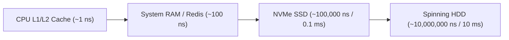
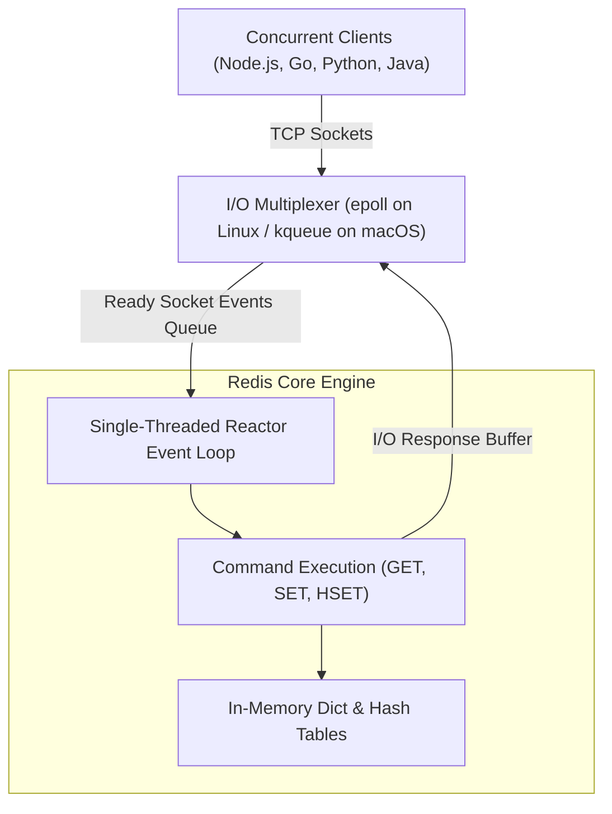
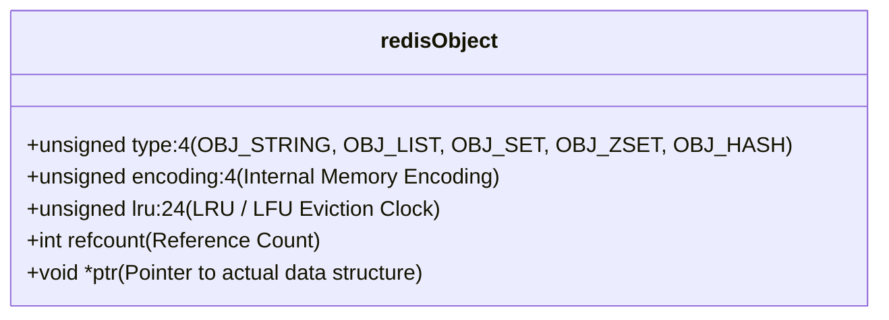
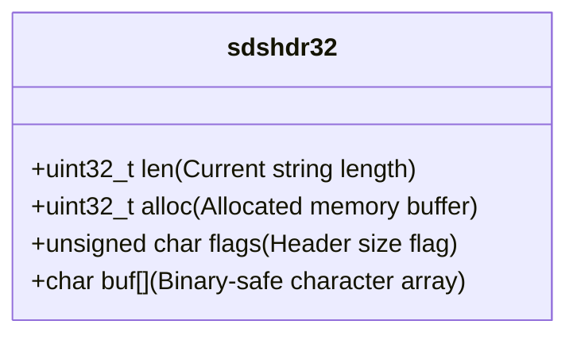
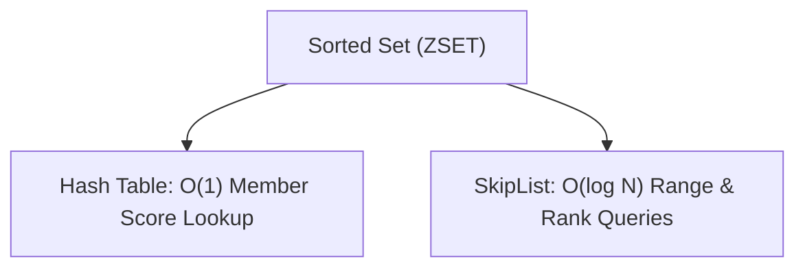
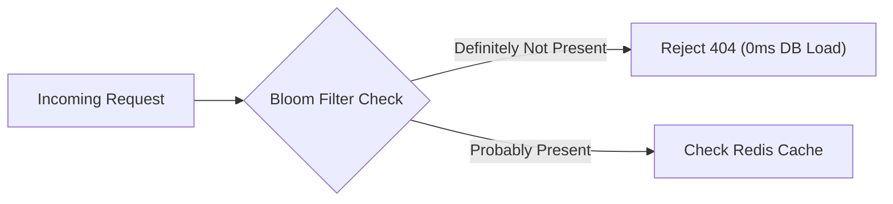
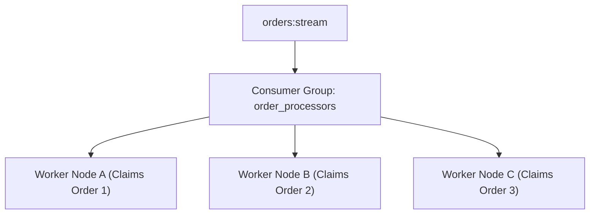
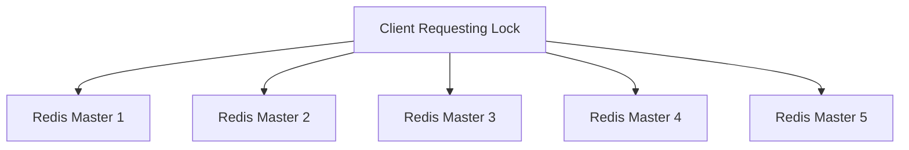
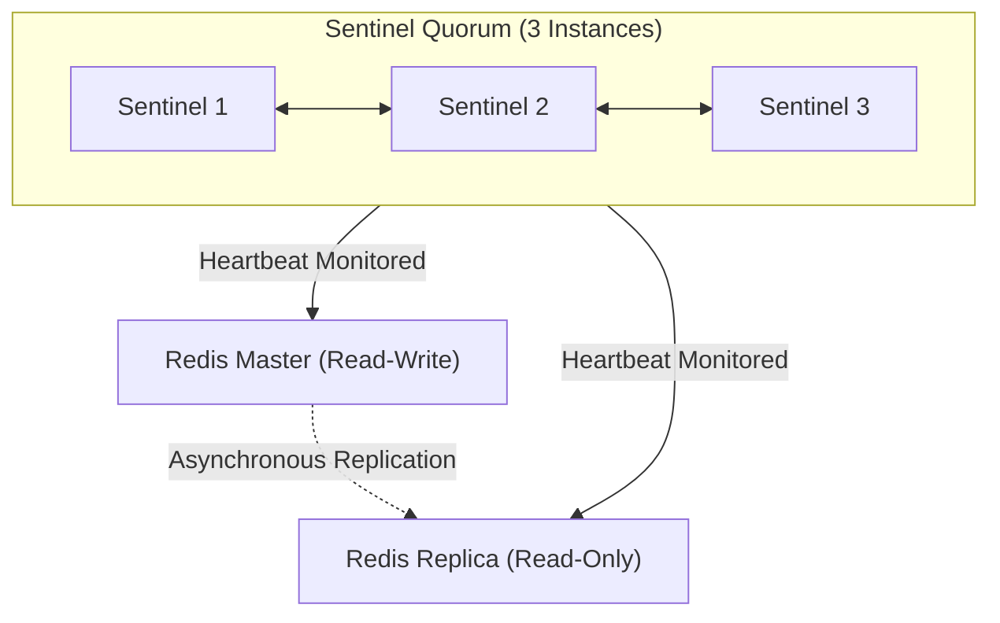
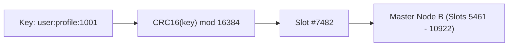

# Learn Redis ⚡

<div align="center">

[](https://opensource.org/licenses/MIT)
[](https://redis.io/)
[](https://nodejs.org/)
[](https://github.com/manthanank/learn-redis)

**An exhaustive, production-grade masterclass from absolute zero to staff-level In-Memory Systems Architect & High-Performance SRE.**  
Master the Redis event loop, RESP3 serialization protocol, 9 core data structures, advanced caching strategies (Cache-Aside, Write-Behind, Stampede & Penetration defenses), Redis Streams & consumer groups, atomic Lua scripts, Redlock distributed locking, RDB/AOF persistence, Sentinel failover, and Redis Cluster 16,384 hash slot partitioning.

[Getting Started](#1-stage-1-absolute-beginner-foundations--in-memory-architecture) • [Data Structures](#2-stage-2-core-data-structures-deep-dive) • [Caching Patterns](#3-stage-3-advanced-caching-patterns--failure-mitigation) • [Streams & Pub/Sub](#4-stage-4-streams-pubsub--asynchronous-messaging) • [Transactions & Lua](#5-stage-5-transactions-lua-scripting--distributed-locks) • [Persistence & Clustering](#6-stage-6-persistence-replication-sentinel--redis-cluster) • [SRE Interview Handbook](#7-stage-7-staff-in-memory-systems--sre-interview-handbook)

<br/>

<a href="https://www.buymeacoffee.com/manthanank">
  
</a>

</div>

---

## 🗺️ 7-Stage Pedagogical Roadmap


| Stage | Focus Domain | Core Concepts & Engineering Outcomes |
| :--- | :--- | :--- |
| **Stage 1** | **Foundations & Architecture** | Single-threaded event loop (epoll / kqueue), RESP3 protocol, memory vs disk trade-offs, `redis-cli` power commands, `SCAN` vs `KEYS`. |
| **Stage 2** | **9 Core Data Structures** | Strings, Hashes, Lists, Sets, Sorted Sets (ZSET with SkipLists), Bitmaps, HyperLogLog, Geospatial, and Bitfields. |
| **Stage 3** | **Enterprise Caching & Defenses** | Cache-Aside, Write-Through, Write-Behind, Cache Stampede / Thundering Herd defenses, Bloom filters for Cache Penetration, TTL jitter. |
| **Stage 4** | **Streams, Pub/Sub & Queues** | Pub/Sub limitations, Redis Streams (`XADD`, `XREADGROUP`), Consumer Groups, ACK processing, message claiming, Pending Entries List (PEL). |
| **Stage 5** | **Transactions, Lua & Redlock** | `MULTI`/`EXEC`/`WATCH` optimistic locking, ACID guarantees, Redis 7 Functions (`fcall`), Redlock distributed mutual exclusion algorithm. |
| **Stage 6** | **Persistence & High Availability** | RDB snapshotting, AOF append-only logging (fsync policies), Master-Replica sync, Redis Sentinel auto-failover, Redis Cluster 16,384 hash slots. |
| **Stage 7** | **Staff SRE Interview Handbook** | Memory fragmentation ratio diagnostics, big keys discovery, LRU/LFU eviction policies, 25 staff interview Q&As, CLI cheat sheet. |

---

## 📋 Comprehensive Table of Contents

1. [Stage 1: Absolute Beginner Foundations & In-Memory Architecture](#1-stage-1-absolute-beginner-foundations--in-memory-architecture)
   - 1.1 [Why Redis? RAM Latency vs Disk Latency](#11-why-redis-ram-latency-vs-disk-latency)
   - 1.2 [The Single-Threaded Reactor Event Loop Architecture](#12-the-single-threaded-reactor-event-loop-architecture)
   - 1.3 [The RESP (REdis Serialization Protocol) Standard](#13-the-resp-redis-serialization-protocol-standard)
   - 1.4 [Essential redis-cli Commands & Cursor Scanning](#14-essential-redis-cli-commands--cursor-scanning)
   - 1.5 [Line-by-Line Breakdown: Core CLI Operations](#15-line-by-line-breakdown-core-cli-operations)
2. [Stage 2: Core Data Structures Deep Dive](#2-stage-2-core-data-structures-deep-dive)
   - 2.1 [Strings: SDS (Simple Dynamic String) Internals](#21-strings-sds-simple-dynamic-string-internals)
   - 2.2 [Hashes: Memory-Efficient Key-Value Dictionaries](#22-hashes-memory-efficient-key-value-dictionaries)
   - 2.3 [Lists: QuickLists & Double-Ended Queues](#23-lists-quicklists--double-ended-queues)
   - 2.4 [Sets & Sorted Sets (ZSET): SkipLists & Rank Queries](#24-sets--sorted-sets-zset-skiplists--rank-queries)
   - 2.5 [Advanced Structures: Bitmaps, HyperLogLog & Geospatial](#25-advanced-structures-bitmaps-hyperloglog--geospatial)
3. [Stage 3: Advanced Caching Patterns & Failure Mitigation](#3-stage-3-advanced-caching-patterns--failure-mitigation)
   - 3.1 [Caching Topologies: Cache-Aside vs Write-Through vs Write-Behind](#31-caching-topologies-cache-aside-vs-write-through-vs-write-behind)
   - 3.2 [Cache Stampede / Thundering Herd Defense (Probabilistic XFetch & Locks)](#32-cache-stampede--thundering-herd-defense)
   - 3.3 [Cache Penetration Mitigation with Bloom Filters](#33-cache-penetration-mitigation-with-bloom-filters)
   - 3.4 [Cache Breakdown & Avalanche Prevention with TTL Jitter](#34-cache-breakdown--avalanche-prevention-with-ttl-jitter)
4. [Stage 4: Streams, Pub/Sub & Asynchronous Messaging](#4-stage-4-streams-pubsub--asynchronous-messaging)
   - 4.1 [Pub/Sub Architecture & The "Fire and Forget" Trap](#41-pubsub-architecture--the-fire-and-forget-trap)
   - 4.2 [Redis Streams: Append-Only Radix Tree Log Architecture](#42-redis-streams-append-only-radix-tree-log-architecture)
   - 4.3 [Consumer Groups & Pending Entries List (PEL)](#43-consumer-groups--pending-entries-list-pel)
   - 4.4 [Message Claiming, Dead Letter Queues & Idempotency](#44-message-claiming-dead-letter-queues--idempotency)
5. [Stage 5: Transactions, Lua Scripting & Distributed Locks](#5-stage-5-transactions-lua-scripting--distributed-locks)
   - 5.1 [Optimistic Concurrency: MULTI, EXEC, and WATCH](#51-optimistic-concurrency-multi-exec-and-watch)
   - 5.2 [Server-Side Lua Scripting & Redis 7 Functions (fcall)](#52-server-side-lua-scripting--redis-7-functions-fcall)
   - 5.3 [Distributed Locking: The Redlock Algorithm Deep Dive](#53-distributed-locking-the-redlock-algorithm-deep-dive)
6. [Stage 6: Persistence, Replication, Sentinel & Redis Cluster](#6-stage-6-persistence-replication-sentinel--redis-cluster)
   - 6.1 [Persistence Mechanics: RDB Snapshots vs AOF Append-Only](#61-persistence-mechanics-rdb-snapshots-vs-aof-append-only)
   - 6.2 [AOF Rewrite & Copy-on-Write (fork) Memory Footprint](#62-aof-rewrite--copy-on-write-fork-memory-footprint)
   - 6.3 [Master-Replica Replication & Diskless Sync](#63-master-replica-replication--diskless-sync)
   - 6.4 [High Availability with Redis Sentinel](#64-high-availability-with-redis-sentinel)
   - 6.5 [Horizontal Scalability: Redis Cluster & 16,384 Hash Slots](#65-horizontal-scalability-redis-cluster--16384-hash-slots)
7. [Stage 7: Staff In-Memory Systems & SRE Interview Handbook](#7-stage-7-staff-in-memory-systems--sre-interview-handbook)
   - 7.1 [Memory Eviction Policies (noeviction, allkeys-lru, volatile-lfu)](#71-memory-eviction-policies)
   - 7.2 [Diagnosing Memory Fragmentation & Big Keys](#72-diagnosing-memory-fragmentation--big-keys)
   - 7.3 [25 Staff-Level Redis Interview Q&As](#73-25-staff-level-redis-interview-qas)
   - 7.4 [The Ultimate Redis Production SRE CLI Cheat Sheet](#74-the-ultimate-redis-production-sre-cli-cheat-sheet)


---

## 1. Stage 1: Absolute Beginner Foundations & In-Memory Architecture

### 1.1 Why Redis? RAM Latency vs Disk Latency
**Redis (Remote Dictionary Server)** is an open-source, in-memory data structure store used as a distributed database, cache, message broker, and streaming engine.
Physical computer hardware enforces a massive latency gulf between RAM and persistent disk:



- Reading from RAM is approximately **1,000 times faster** than reading from high-speed NVMe SSDs and **100,000 times faster** than spinning hard drives.
- Redis serves reads and writes with **sub-millisecond latency** ($<0.5 \text{ ms}$), enabling applications to handle hundreds of thousands of operations per second on a single machine.

---

### 1.2 The Single-Threaded Reactor Event Loop Architecture
A frequent question from engineers is: *"If Redis is single-threaded, how does it process 150,000+ operations per second?"*



- **I/O Multiplexing**: Redis uses non-blocking kernel socket polling (`epoll` on Linux). A single operating system thread monitors thousands of client sockets simultaneously.
- **Zero Lock Contention**: Because command execution is strictly single-threaded, Redis eliminates race conditions, mutex deadlocks, and context-switching overhead. Operations execute deterministically in memory.
- **Threaded I/O (Redis 6+)**: While command execution remains strictly single-threaded, background helper threads handle socket network reads, writes, and protocol parsing in parallel across multi-core CPUs.

---

### 1.3 The RESP (REdis Serialization Protocol) Standard
Client libraries communicate with the Redis server using the human-readable, binary-safe **RESP** protocol:

| Data Type | Byte Prefix | Wire Format Example | Meaning |
| :--- | :---: | :--- | :--- |
| **Simple String** | `+` | `+OK\r\n` | Success confirmation without newlines. |
| **Error** | `-` | `-ERR unknown command 'FOO'\r\n` | Protocol or operational error message. |
| **Integer** | `:` | `:1000\r\n` | 64-bit signed integer. |
| **Bulk String** | `$` | `$6\r\nfoobar\r\n` | Binary-safe string with length prefix (supports UTF-8, images, JSON). |
| **Array** | `*` | `*2\r\n$3\r\nfoo\r\n$3\r\nbar\r\n` | Multi-element command argument or response list. |

---

### 1.4 Essential redis-cli Commands & Cursor Scanning
Common commands to inspect and interact with the database:

```bash
# Connect to remote Redis instance with authentication
redis-cli -h redis.production.internal -p 6379 -a "SuperSecretSecurePass"
```

```text
127.0.0.1:6379> PING
PONG

# Store key with Time-To-Live (TTL) of 60 seconds
127.0.0.1:6379> SET user:1001:session "jwt_token_payload" EX 60
OK

# Inspect remaining time to live in seconds
127.0.0.1:6379> TTL user:1001:session
(integer) 54

# DANGER IN PRODUCTION: KEYS * blocks the single-threaded event loop!
# NEVER RUN IN PRODUCTION:
127.0.0.1:6379> KEYS user:*

# PRODUCTION SAFE ALTERNATIVE: SCAN with cursor pagination
127.0.0.1:6379> SCAN 0 MATCH user:* COUNT 100
1) "17"               # Next cursor index to pass in next call (0 = finished)
2) 1) "user:1001"
   2) "user:1002"
```

---

### 1.5 Line-by-Line Breakdown: Core CLI Operations

| Command / Flag | Operational Complexity | Technical Behavior & Production Impact |
| :--- | :---: | :--- |
| `SET key val EX 60` | $O(1)$ | Atomically writes value and sets expiration to 60 seconds; avoids race conditions between `SET` and `EXPIRE`. |
| `GET key` | $O(1)$ | Direct hashtable lookup in memory; returns bulk string or `(nil)` if key does not exist or expired. |
| `SCAN cursor MATCH pat` | $O(1)$ per step | Cursor-based bucket iteration; yields chunks without blocking other concurrent client requests. |
| `DEL key1 key2` | $O(N)$ | Synchronously deletes keys and frees memory. For massive hashes or sets, use non-blocking `UNLINK` instead! |
| `UNLINK key` | $O(1)$ | Removes key from keyspace instantaneously in $O(1)$ time; deallocates memory asynchronously in a background thread. |


---


---

### 1.6 Redis Object Encoding Internals (robj)
Every key-value entry in Redis is wrapped in a `redisObject` (robj) structure:



Redis dynamically alters the internal encoding of data structures to save RAM:

| Object Type | Memory Size | Internal Encoding | Performance / Memory Characteristics |
| :--- | :--- | :--- | :--- |
| **String** | Value is integer $\le 2^{63}-1$ | `OBJ_ENCODING_INT` | Stores 64-bit integer directly inside pointer `ptr` (Zero allocation). |
| **String** | Length $\le 44$ bytes | `OBJ_ENCODING_EMBSTR` | Allocates `redisObject` and `sdshdr` in a single contiguous memory block (1 cache miss). |
| **String** | Length $> 44$ bytes | `OBJ_ENCODING_RAW` | Allocates `redisObject` and `sdshdr` in separate memory blocks. |
| **Hash** | Small field count & small values | `OBJ_ENCODING_LISTPACK` | Packed byte array in memory (saves up to 80% RAM vs standard hash table). |
| **Hash** | Large field count or large values | `OBJ_ENCODING_HT` | Dual-table hash dictionary supporting incremental rehashing. |
| **ZSet** | Elements $\le 128$ and length $\le 64$B | `OBJ_ENCODING_LISTPACK` | Packed byte array. |
| **ZSet** | Standard threshold exceeded | `OBJ_ENCODING_SKIPLIST` | SkipList + Hash Table hybrid. |

```bash
# Inspect the runtime memory encoding of any key
127.0.0.1:6379> OBJECT ENCODING user:1001:login_count
"int"
```


## 2. Stage 2: Core Data Structures Deep Dive

### 2.1 Strings: SDS (Simple Dynamic String) Internals
Redis Strings are not C null-terminated strings (`char*`). They are stored in a custom C struct called **SDS (Simple Dynamic String)**:



- **$O(1)$ Length Lookups**: The string length is cached in `len`, eliminating $O(N)$ `strlen()` scans.
- **Binary Safe**: Can contain null bytes (`\0`), raw byte buffers, serialized Protobufs, or JPEG image binaries.
- **Buffer Overflow Protection**: SDS automatically reallocates and doubles capacity if append operations exceed `alloc`.

---

### 2.2 Hashes: Memory-Efficient Key-Value Dictionaries
Hashes map string fields to string values, ideal for representing application domain entities (users, products, shopping carts):

```text
# Atomically set multiple fields
HSET user:42 name "Alex" role "admin" login_count 1

# Increment a specific numerical field atomically
HINCRBY user:42 login_count 1
(integer) 2

# Retrieve specific fields in O(1) time
HMGET user:42 name role
1) "Alex"
2) "admin"
```

---

### 2.3 Lists: QuickLists & Double-Ended Queues
Redis Lists are implemented internally as **QuickLists** (a doubly-linked list of memory-packed ZipLists), providing $O(1)$ insertions and deletions at both ends:

```text
# Push items to the head of the list (Producer)
LPUSH tasks:high_priority "task_uuid_101" "task_uuid_102"

# Non-blocking pop from tail (Consumer)
RPOP tasks:high_priority
"task_uuid_101"

# Blocking pop: Waits up to 10 seconds for work without busy-polling!
BRPOP tasks:high_priority 10
```

---

### 2.4 Sets & Sorted Sets (ZSET): SkipLists & Rank Queries
- **Sets (`SADD`, `SMEMBERS`, `SINTER`)**: Unordered collection of unique strings. Perfect for tagging systems and computing mutual friends via set intersection.
- **Sorted Sets / ZSET (`ZADD`, `ZRANGE`, `ZRANK`)**: Every member is associated with a floating-point **score**. Members are maintained sorted at all times using a **SkipList + Hash Table** hybrid structure!



```text
# Build an Enterprise Gaming Leaderboard
ZADD leaderboard:gaming 9500 "PlayerAlpha" 12400 "PlayerOmega" 8100 "PlayerBeta"

# Retrieve top 2 highest scoring players in descending order with scores
ZREVRANGE leaderboard:gaming 0 1 WITHSCORES
1) "PlayerOmega"
2) "12400"
3) "PlayerAlpha"
4) "9500"

# Query the exact zero-based rank of a player in O(log N) time
ZREVRANK leaderboard:gaming "PlayerAlpha"
(integer) 1
```

---

### 2.5 Advanced Structures: Bitmaps, HyperLogLog & Geospatial

| Structure | Typical Commands | Memory Requirement | Operational Engineering Use Case |
| :--- | :--- | :--- | :--- |
| **Bitmaps** | `SETBIT`, `GETBIT`, `BITCOUNT`, `BITOP` | 1 byte per 8 users | Tracking daily active users (DAU); 100 million users tracked in only **12 MB RAM**! |
| **HyperLogLog** | `PFADD`, `PFCOUNT`, `PFMERGE` | **Fixed 12 KB RAM** | Estimating unique website visitors with standard error rate $<0.81\%$, even for billions of events. |
| **Geospatial** | `GEOADD`, `GEODIST`, `GEOSEARCH` | Sorted Set (52-bit Geohash) | Finding nearby couriers or restaurants within a 5 km radius of GPS coordinates. |


---


---

### 2.6 Line-by-Line Breakdown: Bitmaps & HyperLogLog Operations

```bash
# 1. Record user activity on day 2026-09-06 (User ID: 1042)
SETBIT user:active:2026-09-06 1042 1

# 2. Check if user 1042 was active
GETBIT user:active:2026-09-06 1042

# 3. Calculate total Daily Active Users (DAU) across entire platform
BITCOUNT user:active:2026-09-06

# 4. Perform Bitwise AND across 7 days to calculate Weekly Active Users (WAU)
BITOP AND users:wau:week36 user:active:2026-09-01 user:active:2026-09-02 user:active:2026-09-03
```

| Operation / Command | Complexity | Operational Advantage |
| :--- | :---: | :--- |
| `SETBIT key offset val` | $O(1)$ | Sets single bit at numerical offset; automatically grows string in memory without allocations. |
| `BITCOUNT key` | $O(N)$ bytes | Hardware-accelerated CPU instruction (`POPCNT`) to count set bits across millions of users in microseconds. |
| `BITOP AND dest k1 k2` | $O(N)$ bytes | Vectorized bitwise algebra; computes cohorts (e.g. users active on both Monday AND Friday) in $<5\text{ ms}$. |
| `PFADD key elem...` | $O(1)$ | Hashes item using 64-bit hash; updates 16,384 6-bit registers using HyperLogLog probability math. |
| `PFCOUNT key` | $O(1)$ | Computes harmonic mean of leading zeros across registers to estimate unique cardinality with 0.81% error. |


## 3. Stage 3: Advanced Caching Patterns & Failure Mitigation

### 3.1 Caching Topologies: Cache-Aside vs Write-Through vs Write-Behind

```mermaid
flowchart TD
    subgraph CacheAside["Cache-Aside (Lazy Loading)"]
        A1["Application"] -->|1. Read Cache| C1["Redis"]
        C1 -->|2. Cache Miss| A1
        A1 -->|3. Read DB| D1["PostgreSQL"]
        A1 -->|4. Populate Cache| C1
    end
    subgraph WriteBehind["Write-Behind (Write-Back)"]
        A2["Application"] -->|1. Write Cache (Fast)| C2["Redis"]
        C2 -.->|2. Async Batch Flusher| D2["PostgreSQL"]
    end
```

- **Cache-Aside (Lazy Loading)**: Most popular web pattern. Application queries Redis first; on miss, queries database and writes result back to Redis with a TTL.
- **Write-Through**: Application writes data to the caching layer; cache synchronously writes to the database before acknowledging success.
- **Write-Behind (Write-Back)**: Application writes exclusively to Redis with sub-millisecond latency. An asynchronous worker flushes changes to the database in batches, achieving maximum write throughput at the risk of losing un-flushed writes during a crash.

---

### 3.2 Cache Stampede / Thundering Herd Defense
When a popular cached key expires (e.g. homepage trending feed with 50,000 req/sec), thousands of concurrent requests encounter a cache miss simultaneously and hammer the primary database, crashing it.

#### Solution 1: Mutex Lock (Single-Flight Pattern)
```javascript
// Node.js Mutex Pattern for Cache Stampede
async function getTrendingFeed() {
  const cacheKey = "feed:trending";
  let data = await redis.get(cacheKey);
  if (data) return JSON.parse(data);

  // Acquire distributed mutex lock with 5 second lease
  const lockKey = "lock:" + cacheKey;
  const acquired = await redis.set(lockKey, "1", "NX", "EX", 5);

  if (acquired) {
    try {
      // Sole thread responsible for rebuilding cache
      data = await db.fetchTrendingFeedFromDatabase();
      await redis.set(cacheKey, JSON.stringify(data), "EX", 300);
      return data;
    } finally {
      await redis.del(lockKey);
    }
  } else {
    // Other threads sleep 50ms and retry reading cache
    await sleep(50);
    return getTrendingFeed();
  }
}
```

#### Solution 2: Probabilistic Early Expiration (XFetch Algorithm)
Computes a probability of re-fetching data *before* it officially expires:
$$\text{Rebuild if: } -\beta \times \delta \times \ln(\text{rand}()) > \text{TTL}$$
Where $\beta > 0$ is aggressiveness and $\delta$ is computation compute duration.

---

### 3.3 Cache Penetration Mitigation with Bloom Filters
**Cache Penetration** occurs when an attacker requests keys that do not exist in either Redis or the database (e.g. `user:invalid_random_uuid_999999`). Every request bypasses the cache and floods the database disk.



- A **Bloom Filter** is a space-efficient probabilistic data structure that guarantees zero false negatives. If the filter reports an ID does not exist, the server drops the request immediately without touching the database!

---

### 3.4 Cache Breakdown & Avalanche Prevention with TTL Jitter
If 100,000 product keys are cached during nightly batch sync with an identical TTL of `3600` seconds, all 100,000 keys will expire simultaneously at the 1-hour mark (**Cache Avalanche**).

```javascript
// Safe TTL Jitter Calculation
function getJitteredTTL(baseSeconds = 3600, jitterRange = 300) {
  // Add random delta between -300s and +300s
  const delta = Math.floor(Math.random() * (jitterRange * 2)) - jitterRange;
  return baseSeconds + delta;
}
```


---


---

### 3.5 Sliding Window Counter Rate Limiter (ZSET Implementation)
A sliding window rate limiter avoids the edge burst vulnerability of fixed-window counters:

```javascript
// High-Precision Sliding Window Rate Limiter in Node.js
async function isRateLimited(userId, limit = 100, windowSeconds = 60) {
  const key = `ratelimit:${userId}`;
  const now = Date.now();
  const clearBefore = now - (windowSeconds * 1000);

  const pipeline = redis.pipeline();
  // 1. Remove all requests older than the sliding window
  pipeline.zremrangebyscore(key, 0, clearBefore);
  // 2. Add current request timestamp as score and unique member
  pipeline.zadd(key, now, `${now}-${Math.random()}`);
  // 3. Count requests remaining in current sliding window
  pipeline.zcard(key);
  // 4. Refresh TTL to prevent orphaned memory
  pipeline.expire(key, windowSeconds);

  const results = await pipeline.exec();
  const requestCount = results[2][1];

  return requestCount > limit;
}
```

| Pipeline Step | Command | Technical Function |
| :--- | :--- | :--- |
| Step 1 | `ZREMRANGEBYSCORE` | Automatically purges all events older than $T - \text{window}$, rolling the window forward in $O(\log N + M)$ time. |
| Step 2 | `ZADD key timestamp id` | Inserts current request timestamp as score; random suffix guarantees member uniqueness. |
| Step 3 | `ZCARD key` | Evaluates total cardinality in the window in $O(1)$ time. |
| Step 4 | `EXPIRE key window` | Sets key lifetime to expire if client goes inactive, eliminating keyspace leaks. |


## 4. Stage 4: Streams, Pub/Sub & Asynchronous Messaging

### 4.1 Pub/Sub Architecture & The "Fire and Forget" Trap
Redis Pub/Sub decouples publishers from subscribers:

```mermaid
flowchart TD
    Publisher["Publisher Client"] -->|PUBLISH chat:general 'Hello'| Redis["Redis Server"]
    Redis -->|Push Message| Sub1["Subscriber 1 (Online)"]
    Redis -->|Push Message| Sub2["Subscriber 2 (Online)"]
    Redis -.x|Lost!| Sub3["Subscriber 3 (Offline / Reconnecting)"]
```

- **The Danger of Pub/Sub**: Redis Pub/Sub does **NOT buffer messages**. If a subscriber disconnects for 2 seconds due to network blip, all messages broadcast during that window are permanently lost!
- **Use Pub/Sub for**: Ephemeral telemetry, real-time chat broadcasts, cache invalidation pings where message loss is acceptable.
- **Use Streams for**: Mission-critical orders, financial transactions, payment processing pipelines.

---

### 4.2 Redis Streams: Append-Only Radix Tree Log Architecture
Redis Streams (`XADD`, `XRANGE`) provide a persistent, append-only message log inspired by Apache Kafka:

```text
# 1. Produce message to stream (auto-generate millisecond timestamp ID)
XADD orders:stream * user_id 1042 amount 129.99 currency "USD"
"1725608400000-0"

# 2. Inspect stream length
XLEN orders:stream
(integer) 1

# 3. Read range of messages
XRANGE orders:stream - + COUNT 10
```

---

### 4.3 Consumer Groups & Pending Entries List (PEL)
Consumer groups allow multiple microservice worker processes to divide work evenly without message collisions:



```text
# Step 1: Create Consumer Group starting from beginning of stream (ID 0)
XGROUP CREATE orders:stream order_processors 0

# Step 2: Worker A reads up to 2 unread messages
XREADGROUP GROUP order_processors worker_A COUNT 2 STREAMS orders:stream >

# Step 3: Acknowledge successful processing (removes message from PEL)
XACK orders:stream order_processors "1725608400000-0"
```

---

### 4.4 Message Claiming, Dead Letter Queues & Idempotency
If `worker_A` crashes after fetching a message but before executing `XACK`, the message sits in the **Pending Entries List (PEL)**.
Other workers discover hung messages using `XPENDING` and claim them using `XAUTOCLAIM`:

```text
# Claim messages idle for more than 60,000 milliseconds (60s)
XAUTOCLAIM orders:stream order_processors worker_B 60000 0-0 COUNT 10
```


---


---

### 4.5 Production Stream Worker Implementation (Node.js)

```javascript
import Redis from 'ioredis';
const redis = new Redis();

const STREAM_NAME = 'events:orders';
const GROUP_NAME = 'fulfillment_service';
const CONSUMER_NAME = `worker_${process.pid}`;

async function startConsumer() {
  // Ensure consumer group exists
  try {
    await redis.xgroup('CREATE', STREAM_NAME, GROUP_NAME, '$', 'MKSTREAM');
  } catch (err) {
    // Group already exists
  }

  while (true) {
    try {
      // Read up to 10 unread items; block for 5000ms if empty
      const response = await redis.xreadgroup(
        'GROUP', GROUP_NAME, CONSUMER_NAME,
        'BLOCK', 5000,
        'COUNT', 10,
        'STREAMS', STREAM_NAME, '>'
      );

      if (!response) continue;

      const [stream, messages] = response[0];
      for (const [id, fields] of messages) {
        console.log(`Processing message ${id}:`, fields);
        // Process business logic...
        
        // Acknowledge completion
        await redis.xack(STREAM_NAME, GROUP_NAME, id);
      }
    } catch (error) {
      console.error('Stream processing error:', error);
      await new Promise(r => setTimeout(r, 1000));
    }
  }
}
```

| Stream Directive | Technical Meaning | Production Guarantee |
| :--- | :--- | :--- |
| `'$'` | Initial Stream Offset | When creating group, `$` listens only to future messages; `0` processes all past history. |
| `'MKSTREAM'` | Auto Stream Creation | Creates empty stream automatically if stream does not already exist. |
| `'>'` | Undelivered Messages | Instructs Redis to return only messages that have never been delivered to any consumer in the group. |
| `'BLOCK 5000'` | Non-Busy Polling | Suspends socket in kernel poll for up to 5 seconds; instantly wakes when new message arrives. |
| `XACK` | Acknowledgment | Removes message ID from Pending Entries List (PEL), preventing duplicate reprocessing. |


## 5. Stage 5: Transactions, Lua Scripting & Distributed Locks

### 5.1 Optimistic Concurrency: MULTI, EXEC, and WATCH
Redis transactions bundle commands into an atomic queue:

```text
# Check-And-Set (CAS) with WATCH
WATCH balance:account_A

# If another client updates balance:account_A before EXEC, the transaction aborts!
MULTI
DECRBY balance:account_A 100
INCRBY balance:account_B 100
EXEC
```
- Note: Redis transactions **do not support rollback** on runtime error. If a command in `MULTI` fails due to bad syntax or wrong data type, remaining commands still execute.

---

### 5.2 Server-Side Lua Scripting & Redis 7 Functions (fcall)
Lua scripts execute directly inside the Redis event loop, guaranteeing 100% atomicity across multi-step read-modify-write logic without network round-trips:

```lua
-- Atomic Rate Limiter Script (Token Bucket Algorithm)
local key = KEYS[1]
local limit = tonumber(ARGV[1])
local current = tonumber(redis.call('get', key) or "0")

if current + 1 > limit then
    return 0 -- Rate limit exceeded
else
    redis.call('incrby', key, 1)
    if current == 0 then
        redis.call('expire', key, 60)
    end
    return 1 -- Allowed
end
```

---

### 5.3 Distributed Locking: The Redlock Algorithm Deep Dive
A single `SET resource_name my_random_value NX PX 30000` provides safe mutual exclusion on a single Redis instance.
However, in distributed systems with multiple independent Redis masters, the **Redlock** algorithm provides fault-tolerant consensus:



1. Client records the current timestamp with millisecond precision.
2. Tries to acquire the lock sequentially across $N = 5$ independent Redis master nodes using identical key and random value.
3. Lock is successfully acquired only if:
   - Client acquired lock in a majority ($> N/2 = 3$) nodes.
   - Total time elapsed during acquisition is less than lock validity time.
4. If client fails to acquire majority, it unlocks all nodes immediately.


---


---

### 5.4 Production Redlock Algorithm Implementation (TypeScript)

```typescript
import crypto from 'node:crypto';

interface RedisClient {
  set(key: string, val: string, nx: 'NX', px: 'PX', ttl: number): Promise<string | null>;
  eval(script: string, numkeys: number, key: string, val: string): Promise<number>;
}

export class Redlock {
  private clients: RedisClient[];
  private quorum: number;
  private readonly unlockScript = `
    if redis.call("get", KEYS[1]) == ARGV[1] then
      return redis.call("del", KEYS[1])
    else
      return 0
    end
  `;

  constructor(clients: RedisClient[]) {
    this.clients = clients;
    this.quorum = Math.floor(clients.length / 2) + 1;
  }

  async acquireLock(resource: string, ttlMs: number): Promise<{ resource: string; value: string } | null> {
    const randomValue = crypto.randomUUID();
    const startTime = Date.now();
    let acquiredCount = 0;

    // 1. Attempt to acquire lock across all independent instances
    for (const client of this.clients) {
      try {
        const res = await client.set(resource, randomValue, 'NX', 'PX', ttlMs);
        if (res === 'OK') acquiredCount++;
      } catch (err) {
        // Node unreachable
      }
    }

    // 2. Compute validity duration taking clock drift into account
    const clockDrift = (ttlMs * 0.01) + 2; // 1% clock drift + 2ms
    const elapsedTime = Date.now() - startTime;
    const validityTime = ttlMs - elapsedTime - clockDrift;

    // 3. Verify Quorum and Validity Time
    if (acquiredCount >= this.quorum && validityTime > 0) {
      return { resource, value: randomValue };
    }

    // 4. Failed: Release partial locks on all nodes
    await this.releaseLock({ resource, value: randomValue });
    return null;
  }

  async releaseLock(lock: { resource: string; value: string }): Promise<void> {
    for (const client of this.clients) {
      try {
        await client.eval(this.unlockScript, 1, lock.resource, lock.value);
      } catch (err) {
        // Node error
      }
    }
  }
}
```

| Component | Purpose | SRE Guarantee |
| :--- | :--- | :--- |
| `crypto.randomUUID()` | Unique Identifier | Prevents Client A from releasing Client B's lock if Client A's lease expired. |
| `quorum (> N/2)` | Majority Consensus | Tolerates failure of up to $\lfloor N/2 \rfloor$ Redis nodes without split-brain locks. |
| `validityTime` Calculation | Clock Drift Factor | Ensures client has sufficient lease time remaining to execute its critical section. |
| Atomic Unlock Script | Lua Evaluation | Guarantees check-and-delete occurs atomically on each Redis master. |


## 6. Stage 6: Persistence, Replication, Sentinel & Redis Cluster

### 6.1 Persistence Mechanics: RDB Snapshots vs AOF Append-Only

| Feature | RDB (Redis Database Snapshot) | AOF (Append-Only File) |
| :--- | :--- | :--- |
| **Mechanism** | Point-in-time binary snapshot of entire memory space. | Log of every write command executed (`fsync`). |
| **Durability** | Higher data loss risk (loses data since last snapshot). | Near-zero data loss (`appendfsync everysec` = max 1s loss). |
| **File Size** | Extremely compact binary file (`dump.rdb`). | Much larger plain text command stream. |
| **Recovery Speed** | Fast (loads binary into memory directly). | Slower (must replay every command in log). |
| **Recommendation** | Ideal for disaster recovery cold backups. | **Recommended production standard (use both RDB + AOF)**. |

---

### 6.2 AOF Rewrite & Copy-on-Write (fork) Memory Footprint
When AOF grows too large, Redis triggers background rewrite (`BGREWRITEAOF`):
1. Parent process invokes `fork()` to create a child process.
2. Operating system employs **Copy-on-Write (CoW)**: child and parent share the same physical RAM pages.
3. If memory writes occur while child is writing new AOF, the OS copies individual 4 KB pages. If Transparent Huge Pages (THP) is enabled, OS copies 2 MB pages, exhausting RAM! **Always disable THP in production.**

---

### 6.3 Master-Replica Replication & Sentinel Auto-Failover
**Redis Sentinel** monitors master health, sends heartbeats, and orchestrates automatic failover without manual intervention:



---

### 6.4 Horizontal Scalability: Redis Cluster & 16,384 Hash Slots
When dataset size exceeds the physical RAM of a single server (e.g. 500 GB cache), **Redis Cluster** partitions data automatically across master nodes:



- Every key is assigned to one of **16,384 hash slots**:
  $$\text{Slot} = \text{CRC16}(\text{key}) \pmod{16384}$$
- **Hash Tags**: Enforcing multiple keys to land on the exact same node for multi-key operations via `{...}`:
  - `{user:1001}.profile` and `{user:1001}.settings` hash strictly on the substring `user:1001`.


---


---

### 6.5 Redis Sentinel Configuration & Failover Protocol
A production Sentinel configuration (`sentinel.conf`):

```ini
# Monitor master named 'mymaster' with Quorum of 2
sentinel monitor mymaster 10.0.0.1 6379 2

# Master considered unreachable after 5000ms of failed pings (sdown)
sentinel down-after-milliseconds mymaster 5000

# Timeout for complete failover execution
sentinel failover-timeout mymaster 60000

# Number of replicas that can simultaneously resync with new master
sentinel parallel-syncs mymaster 1

# Authentication password for master
sentinel auth-pass mymaster "SuperSecretClusterPass"
```

| Sentinel Event State | Definition | Action Taken |
| :--- | :--- | :--- |
| **`+sdown`** | **Subjective Down** | A single Sentinel instance fails to receive a ping response within `down-after-milliseconds`. |
| **`+odown`** | **Objective Down** | Quorum count (e.g. 2 Sentinels) agree master is down; initiates leader election. |
| **`+try-failover`** | **Failover Initiated** | Elected Sentinel leader coordinates failover protocol. |
| **`+promoted-slave`** | **Replica Promotion** | Best replica (lowest replication lag and priority) is promoted to master via `SLAVEOF NO ONE`. |
| **`+switch-master`** | **Topology Broadcast**| Sentinels update client libraries and reconfigure remaining replicas to replicate from new master. |


## 7. Stage 7: Staff In-Memory Systems & SRE Interview Handbook

### 7.1 Memory Eviction Policies
When memory reaches `maxmemory`, Redis activates its configured eviction policy:

| Policy Name | Selection Strategy | Real-World Use Case |
| :--- | :--- | :--- |
| `noeviction` (Default) | Returns error on new writes; allows reads. | Redis used as a primary persistent database. |
| `allkeys-lru` | Evicts Least Recently Used keys across all keys. | Standard general-purpose web application cache. |
| `allkeys-lfu` | Evicts Least Frequently Used keys across all keys. | Preserves viral/trending items with high access counts. |
| `volatile-lru` | Evicts LRU keys strictly among keys that have an expiration (`EXPIRE`). | Preserves permanent static config keys. |
| `volatile-ttl` | Evicts keys with shortest remaining TTL first. | Prioritizes dropping data closest to expiration. |

---

### 7.2 Diagnosing Memory Fragmentation & Big Keys

```bash
# 1. Inspect memory fragmentation ratio
redis-cli info memory
```
- **`mem_fragmentation_ratio`**: $\frac{\text{used\_memory\_rss}}{\text{used\_memory}}$
  - **Ratio 1.0 - 1.5**: Healthy memory utilization.
  - **Ratio > 1.5**: High OS memory fragmentation (wasted RAM). Mitigate by enabling `activedefrag yes`.
  - **Ratio < 1.0**: System is swapping to disk (fatal performance collapse).

```bash
# 2. Scan keyspace to locate largest keys consuming RAM
redis-cli --bigkeys

# 3. Sample memory footprint of a specific key in bytes
127.0.0.1:6379> MEMORY USAGE user:1001
(integer) 4096
```

---

### 7.3 25 Staff-Level Redis Interview Q&As

#### Q1: Why is Redis single-threaded for command execution, and why does this design choice succeed?
**Answer:** The primary bottleneck in memory caching systems is not CPU calculation, but memory bandwidth and network I/O. Executing commands in a single thread eliminates CPU context-switching overhead and removes the need for complex synchronization locks (mutexes, rwlocks, spinlocks) that destroy concurrency in multi-threaded systems. Furthermore, modern Redis versions offload network socket reads/writes to background I/O threads while keeping core dictionary mutations purely single-threaded.

#### Q2: What is the difference between Redis Pub/Sub and Redis Streams?
**Answer:** Pub/Sub is a push-based "fire-and-forget" broadcasting system with zero persistence. If a subscriber is offline, the message is discarded and irrecoverable. Redis Streams is a persistent append-only log data structure modeled after Kafka. Streams retain messages on disk/RAM, support consumer groups, acknowledge message delivery via `XACK`, track unacknowledged messages via Pending Entries Lists (PEL), and allow historical replays via `XRANGE`.

#### Q3: Explain how the SkipList data structure works inside Sorted Sets (ZSET).
**Answer:** A SkipList is a probabilistic multi-level linked list that achieves $O(\log N)$ search, insertion, and deletion complexity, matching balanced trees (AVL or Red-Black trees) without requiring complex tree rotations. The base level (Level 0) contains a sorted linked list of all elements. Higher levels act as "express lanes", skipping multiple nodes. When inserting an element, a random coin-flip determines how many express levels the element promotes to. ZSET pairs this SkipList with a Hash Table to achieve $O(1)$ score lookups and $O(\log N)$ rank queries.

#### Q4: How does Redis handle Key Expiration (Passive vs Active)?
**Answer:** Redis employs a hybrid expiration model:
1. **Passive Expiration**: When a client requests a key via `GET`, Redis checks its TTL. If expired, Redis deletes the key immediately and returns `(nil)`.
2. **Active Expiration**: 10 times per second, Redis randomly tests 20 keys with active TTLs. If more than 25% are expired, it repeats the process immediately, preventing expired dead keys from lingering indefinitely if never accessed.

#### Q5: What is the Thundering Herd / Cache Stampede problem, and how do you resolve it?
**Answer:** When an intensely queried key expires, thousands of concurrent requests encounter a cache miss at the same microsecond and hit the primary database, causing database saturation and failure. It is resolved via:
1. **Distributed Mutex Lock**: The first thread acquires a lock via `SET lock_key uuid NX EX 5` to rebuild the cache, while other threads wait briefly.
2. **Probabilistic Early Expiration (XFetch)**: Rebuilding the cache asynchronously slightly before the key expires based on read frequency and computation cost.

#### Q6: What is Cache Penetration, and how does a Bloom Filter mitigate it?
**Answer:** Cache Penetration occurs when requests query keys that do not exist in either cache or database (often during malicious scraping or brute-force attacks). Every request misses cache and hits the database. Mitigations include:
1. Caching null values with a short TTL (`SET user:invalid "NULL" EX 60`).
2. Placing a **Bloom Filter** in front of Redis; if the filter indicates the key does not exist, the request is rejected immediately with zero database load.

#### Q7: What are the trade-offs between `appendfsync always`, `everysec`, and `no`?
**Answer:**
- `always`: Flushes to disk after every single write command. Guarantees zero data loss, but performance drops to spinning disk speed (terrible throughput).
- `everysec` (Recommended): Flushes asynchronously once per second. Near-instant RAM speed, with a theoretical maximum data loss window of 1 second during total host power outage.
- `no`: Lets the OS manage flush buffers (typically every 30 seconds). Highest throughput, but highest risk of data loss.

#### Q8: What causes memory bloat during Redis background saves (`BGSAVE` or `BGREWRITEAOF`)?
**Answer:** `BGSAVE` invokes `fork()` to create a background process that writes the snapshot to disk. The operating system uses Copy-on-Write (CoW). If the parent process receives heavy write traffic, modified memory pages must be duplicated. If Transparent Huge Pages (THP) is enabled in the Linux kernel, the OS duplicates 2 MB pages instead of 4 KB pages for any small write, leading to massive memory bloat and sudden OOM termination.

#### Q9: What is the difference between `maxmemory-policy allkeys-lru` and `allkeys-lfu`?
**Answer:** 
- `LRU (Least Recently Used)`: Evicts keys that have not been accessed for the longest duration. Susceptible to cache pollution if a one-time batch scan accesses millions of old keys.
- `LFU (Least Frequently Used)`: Tracks access frequency using a logarithmic counter with decay over time. Keys accessed frequently in the past remain in memory even if temporarily idle.

#### Q10: How does Redis Cluster achieve high availability without requiring Sentinel?
**Answer:** Redis Cluster has built-in master-replica pairing and gossip protocol communication (`meet`, `ping`, `pong`). The cluster nodes constantly ping each other. If a majority of master nodes fail to reach Master A, it is flagged as `FAIL`, and the remaining masters automatically elect one of Master A's replicas and promote it to master, restoring cluster operations automatically.

#### Q11: What is the Redlock algorithm and what are Martin Kleppmann's criticisms of it?
**Answer:** Redlock acquires locks across $N$ independent Redis masters (majority $> N/2$) with a timeout window. Distributed systems researcher Martin Kleppmann argued that Redlock is unsafe for strong mutual exclusion because asynchronous system pauses (e.g. Stop-The-World GC pauses, CPU scheduling stalls, or NTP clock drift) can cause a client's lock lease to expire without its knowledge while it still writes to storage. Kleppmann recommends using fencing tokens (monotonically increasing version numbers) validated at the database storage layer.

#### Q12: Why should `KEYS *` never be run in production, and what should you use instead?
**Answer:** `KEYS *` performs an $O(N)$ full keyspace scan on the single-threaded event loop. On a database with 10 million keys, this blocks all incoming client requests for several seconds, causing API timeouts and service outages. Always use `SCAN` with cursor iteration, which retrieves keys in incremental batches without blocking.

#### Q13: What are Redis Hash Tags and when are they mandatory in Redis Cluster?
**Answer:** In Redis Cluster, multi-key operations (like transactions `MGET`, `SUNION`, Lua scripts) are only permitted if all referenced keys reside on the exact same cluster node. Hash tags `{...}` force Redis to hash only the text enclosed within braces: e.g. `{user:101}:profile` and `{user:101}:orders` will both hash to the exact same slot.

#### Q14: What is the difference between `DEL` and `UNLINK`?
**Answer:** `DEL` removes the key and reclaims its memory synchronously. If deleting a Hash or Set with 1,000,000 elements, `DEL` freezes the Redis thread for hundreds of milliseconds. `UNLINK` removes the key from the keyspace namespace in $O(1)$ time and hands memory deallocation over to an asynchronous background worker thread.

#### Q15: How does Redis achieve sub-millisecond Pub/Sub performance?
**Answer:** Redis maintains a global hash table mapping channel names to linked lists of connected client socket file descriptors. When `PUBLISH channel message` is called, Redis iterates through the client socket list in memory and immediately streams the RESP bulk string directly into each client's output buffer, bypassing any disk operations.

#### Q16: How does Redis implement memory defragmentation?
**Answer:** Memory allocators (like Jemalloc) allocate memory in fixed chunk sizes, leading to holes when keys are deleted. Redis features an Active Memory Defragmenter (`activedefrag yes`) that runs in the background. It scans memory allocations, moves live data to new contiguous memory pages, and frees fragmented old pages back to the operating system without downtime.

#### Q17: What is Client-Side Caching (Tracking Mode) in Redis 6+?
**Answer:** Client-side caching allows application instances to cache Redis keys directly in local application memory (e.g. Node.js heap). Redis tracks which keys each client caches. When a key is mutated in Redis, the server sends an invalidation message over the socket to the client, telling it to purge its local memory cache.

#### Q18: What is the maximum size of a string value, hash field count, and list length in Redis?
**Answer:** A Redis string value can hold up to 512 MB. A Hash, List, Set, or Sorted Set can hold up to $2^{32} - 1$ (over 4.29 billion) elements.

#### Q19: Explain the difference between `EXPIRE` and `EXPIREAT`.
**Answer:** `EXPIRE` sets the time-to-live relative to the current moment in seconds (e.g. expire in 60s). `EXPIREAT` accepts an absolute Unix epoch timestamp (seconds since Jan 1, 1970). For high-precision requirements, `PEXPIRE` and `PEXPIREAT` operate in milliseconds.

#### Q20: What is Redis Sentinel Quorum and why should it always be an odd number?
**Answer:** The Quorum is the minimum number of Sentinel processes that must agree that a master is unreachable (`ODOWN`) before initiating failover. Quorums must be configured with an odd number of Sentinels (3, 5) to avoid split-brain ties during leader election rounds.

#### Q21: What are Redis Bitfields and what is their advantage?
**Answer:** The `BITFIELD` command treats Redis strings as arbitrary arrays of bit integers (signed or unsigned from 1 to 64 bits, e.g. `u4`, `i16`). It allows engineers to store multiple compact integer counters in a single string key with custom overflow behavior (`WRAP`, `SAT`, `FAIL`), saving massive memory in financial or telemetry pipelines.

#### Q22: What happens if a replica loses network connection to its master?
**Answer:** When the connection drops, the replica attempts to reconnect. The master maintains an in-memory replication backlog buffer (ring buffer). If the downtime was brief and the missing offset is still in the buffer, the master sends an incremental partial resynchronization (`PSYNC`). If the downtime exceeded buffer capacity, a full initial sync is triggered.

#### Q23: What are the security risks of Redis and how do you harden it?
**Answer:** Redis is designed for trusted internal networks. Critical hardening steps:
1. Bind only to private loopback/VPC interfaces (`bind 127.0.0.1 10.0.0.5`).
2. Require strong authentication (`requirepass` with 32+ characters).
3. Disable dangerous administrative commands (`rename-command FLUSHALL ""` and `rename-command CONFIG ""`).
4. Enable TLS encryption for in-transit network traffic.

#### Q24: What is the difference between RDB save and bgsave?
**Answer:** `SAVE` runs synchronously in the main thread, blocking all incoming client queries until the snapshot is fully written to disk. `BGSAVE` forks a child process to write the RDB file asynchronously while the parent process continues serving client requests without interruption.

#### Q25: How do you perform a zero-downtime Redis version upgrade?
**Answer:** 
1. Spin up a new replica running the newer Redis version and attach it to the current master.
2. Wait for initial replication synchronization to complete.
3. In Sentinel or Redis Cluster, execute a manual failover (`SENTINEL FAILOVER` or `CLUSTER FAILOVER`) promoting the new replica to master.
4. Upgrade the old master and reattach it as a replica.

---

### 7.4 The Ultimate Redis Production SRE CLI Cheat Sheet

#### Server Health & Metrics
```bash
redis-cli info server         # Version, OS, uptime, and process ID
redis-cli info memory         # Used memory, peak memory, and fragmentation ratio
redis-cli info stats          # Operations per sec, rejected connections, keyspace hits/misses
redis-cli info replication    # Role (master/replica), connected replicas, replication offset
redis-cli info persistence    # RDB last bgsave status and AOF rewrite status
```

#### Diagnostic Power Commands
```text
# Real-time traffic monitor (DANGER: impacts performance, use for debugging only)
redis-cli monitor

# Inspect slowest queries taking longer than slowlog-log-slower-than threshold
127.0.0.1:6379> SLOWLOG GET 10

# View connected client connections
127.0.0.1:6379> CLIENT LIST

# Find memory size of a specific key
127.0.0.1:6379> MEMORY USAGE user:1001
```

---

## 🤝 Community & Contributing
Contributions are welcome! Please review our [CONTRIBUTING.md](CONTRIBUTING.md) and [CODE_OF_CONDUCT.md](CODE_OF_CONDUCT.md) guidelines before opening issues or submitting pull requests.

## 📄 License
This project is open-source software licensed under the [MIT License](LICENSE).


### Complete Redis Enterprise Patterns & Production Code Examples

#### 1. Redis Streams: High-Throughput Event Broker with Consumer Groups
Streams provide persistent, partitioned message queues with consumer acknowledgments and dead-letter recovery:

```bash
# 1. Producer appends order created event (ID auto-generated via '*')
XADD orders:stream * orderId "ord-9921" customerId "cust-441" amount "149.99"

# 2. Create consumer group 'billing-workers' reading from the start ('0')
XGROUP CREATE orders:stream billing-workers 0 MKSTREAM

# 3. Consumer 'worker-1' reads up to 2 unacknowledged messages
XREADGROUP GROUP billing-workers worker-1 COUNT 2 BLOCK 2000 STREAMS orders:stream >

# 4. Acknowledge message processing completion
XACK orders:stream billing-workers "1741340000000-0"

# 5. Inspect pending (unacknowledged/stalled) messages
XPENDING orders:stream billing-workers - + 10

# 6. Claim a message abandoned by a crashed worker (> 60000ms idle)
XCLAIM orders:stream billing-workers worker-2 60000 1741340000000-0
```

---

#### 2. Atomic Lua Scripting: Distributed Token Bucket Rate Limiter
Executes atomically within Redis single-threaded engine, preventing race conditions without multi-network round-trips:

```lua
-- rate_limiter.lua
-- KEYS[1]: rate limit bucket key (e.g., 'ratelimit:user:101')
-- ARGV[1]: max capacity (e.g., 10 tokens)
-- ARGV[2]: refill rate per second (e.g., 2 tokens/sec)
-- ARGV[3]: current timestamp in epoch seconds
-- ARGV[4]: requested tokens (e.g., 1)

local key = KEYS[1]
local capacity = tonumber(ARGV[1])
local refill_rate = tonumber(ARGV[2])
local now = tonumber(ARGV[3])
local requested = tonumber(ARGV[4])

-- Get current bucket state
local data = redis.call('HMGET', key, 'tokens', 'last_updated')
local tokens = tonumber(data[1])
local last_updated = tonumber(data[2])

if tokens == nil then
  tokens = capacity
  last_updated = now
else
  -- Calculate tokens generated since last update
  local delta = math.max(0, now - last_updated)
  tokens = math.min(capacity, tokens + (delta * refill_rate))
  last_updated = now
end

if tokens >= requested then
  tokens = tokens - requested
  redis.call('HMSET', key, 'tokens', tokens, 'last_updated', last_updated)
  redis.call('EXPIRE', key, math.ceil(capacity / refill_rate) * 2)
  return 1 -- Allowed
else
  redis.call('HMSET', key, 'tokens', tokens, 'last_updated', last_updated)
  return 0 -- Rejected (Rate limit exceeded)
end
```

**Executing Lua Script via CLI:**
```bash
redis-cli --eval rate_limiter.lua ratelimit:user:101 , 10 2 $(date +%s) 1
```

---

#### 3. Safe Distributed Lock with Atomic Release Pattern
Prevents split-brain locks and ensures only the lock owner can release the token:

```bash
# 1. Acquire lock with 10s TTL and unique random owner UUID
SET resource:lock:order-9921 "uuid-node-a-987" NX PX 10000
# Returns 'OK' if acquired, nil if already locked by another node

# 2. Release lock ONLY if the value matches the current owner UUID (Atomic Lua)
EVAL "if redis.call('get', KEYS[1]) == ARGV[1] then return redis.call('del', KEYS[1]) else return 0 end" 1 resource:lock:order-9921 "uuid-node-a-987"
```

---

#### 4. Geospatial Proximity Search: Ride-Share Driver Matching
Index spatial longitude/latitude coordinates and query nearest locations within radius:

```bash
# 1. Add driver coordinates (longitude, latitude, memberName)
GEOADD drivers:active -73.9855 40.7484 "driver-car-1"
GEOADD drivers:active -73.9870 40.7510 "driver-car-2"
GEOADD drivers:active -73.9780 40.7600 "driver-car-3"

# 2. Find drivers within a 2 kilometer radius of user pickup location
GEOSEARCH drivers:active FROMLONLAT -73.9850 40.7480 BYRADIUS 2 km ASC WITHDIST WITHCOORD

# 3. Calculate driving distance between two drivers
GEODIST drivers:active "driver-car-1" "driver-car-2" km
```

---

#### 5. HyperLogLog: Memory-Constant Cardinality Estimation
Estimates 100,000,000 unique IP visits with 0.81% standard error using only 12 KB memory:

```bash
# Add daily active user IDs
PFADD daily_active_users:2026-09-07 "usr-1" "usr-2" "usr-3" "usr-1"
PFADD daily_active_users:2026-09-08 "usr-3" "usr-4" "usr-5"

# Count unique users for a single day
PFCOUNT daily_active_users:2026-09-07

# Merge multiple daily sets into weekly unique count with zero recomputation
PFMERGE weekly_active_users daily_active_users:2026-09-07 daily_active_users:2026-09-08
PFCOUNT weekly_active_users
```
